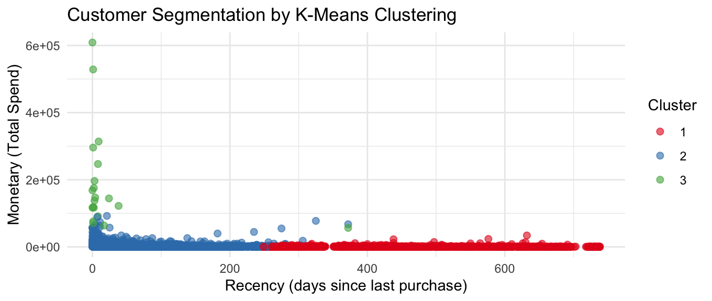

# 🛍️ Customer Segmentation with RFM and K-Means

This project applies **RFM segmentation** and **K-Means clustering** to an online retail dataset in order to identify distinct customer groups for targeted marketing strategies.

---

## 📁 Dataset
- **Source**: Online Retail II (2 sheets merged)
- **Date Range**: December 2009 – December 2011
- **Total Transactions**: ~800,000
- **Filtering**: Only valid `CustomerID` and `Quantity > 0` included

---

## 🎯 Objective
- Use Recency, Frequency, and Monetary metrics to segment customers
- Identify high-value customers, loyal buyers, and dormant segments
- Recommend marketing actions per segment

---

## 🧪 Methodology

1. **Read and combine Excel sheets**
2. **Clean**: remove nulls, calculate `revenue = Quantity * UnitPrice`
3. **Calculate RFM**:
   - Recency: days since last purchase
   - Frequency: number of invoices
   - Monetary: total spend
4. **Standardize features**
5. **K-Means clustering (k=3)** via Elbow Method
6. **Visualize clusters**
7. **Summarize each cluster**

---

## 📈 Visual Output

---

## 💡 Insights

- **Cluster 1 – Dormant Customers**  
  Long inactive and low value – consider win-back campaigns.

- **Cluster 2 – Loyal Regulars**  
  Active buyers with moderate spending – engage and upsell.

- **Cluster 3 – VIPs**  
  Recently active and high spenders – reward and retain.

---

## 📄 Files

| File | Description |
|------|-------------|
| `retail_rfm_kmeans.Rmd` | Full analysis with code |
| `retail_rfm_kmeans.html` | HTML report |
| `images/cluster_plot.png` | RFM Cluster Visualization |
| `README.md` | Project overview |

---

## 🛠️ Tools Used

- R: `dplyr`, `ggplot2`, `lubridate`, `readxl`, `purrr`
- Clustering: K-Means
- IDE: RStudio

---

## 🙋‍♀️ About Me

**Jirawan Phromtawepong**  
Data-driven marketing professional transitioning into analytics and strategy.  
[LinkedIn Profile »](https://www.linkedin.com/in/jirawan-phromtawepong/)
